axiom
axiom envionment (per team)(tesing envionment)

---

about page
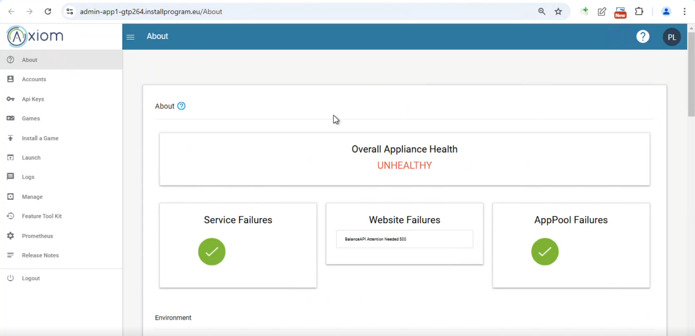
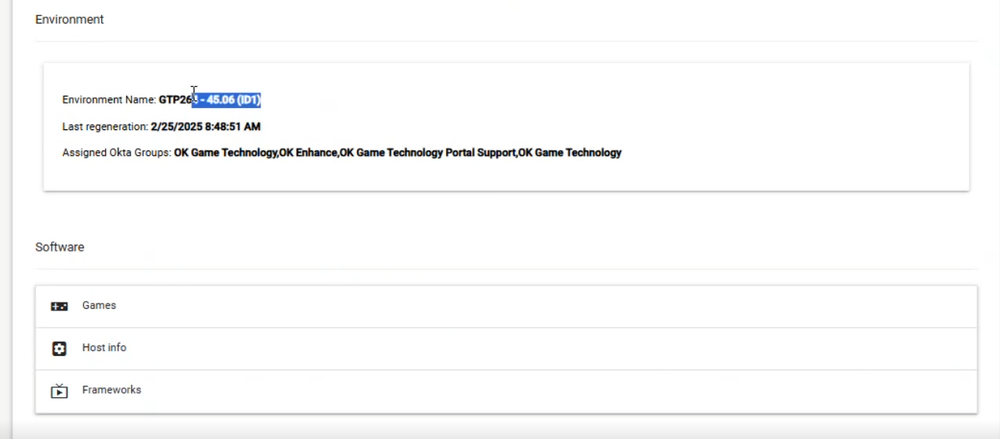
version
heath state

---

user accounts page
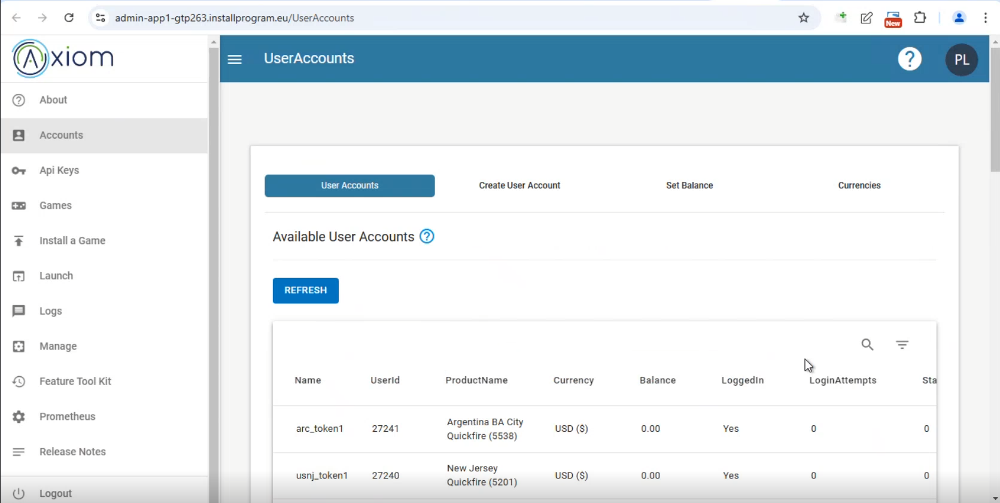

1. user accounts
   available user accounts

2. create user account
   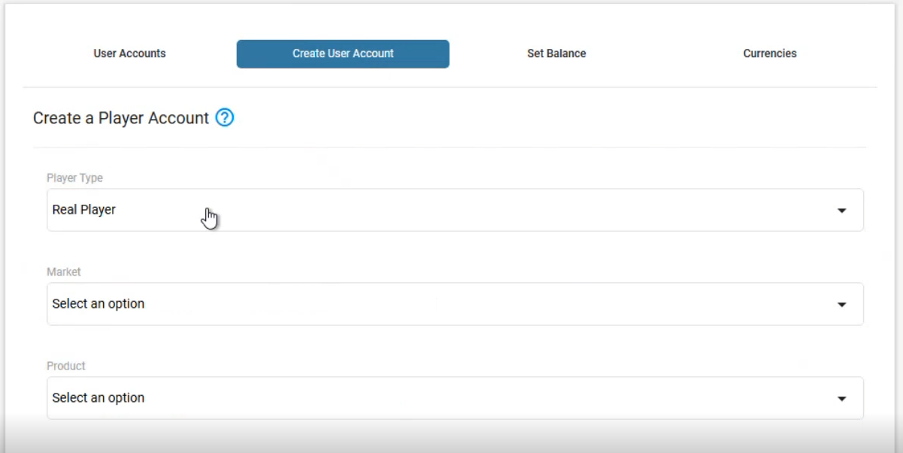
   player type: real player/ guest player/ etc

market: DEF(no regulation)/ UK/ DE/ etc

product: how your game is designed on the product/ lobby/ on which game is instlalled

username:

bulk accounts

country

currency

3. set balance
   username
   balance
   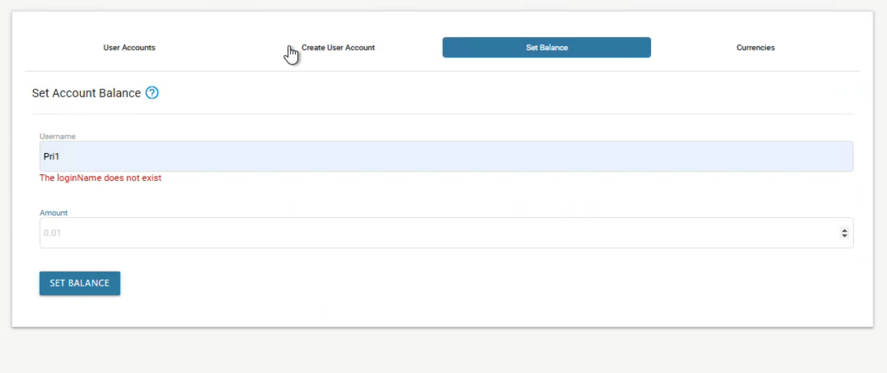
4. currency

---

api page
if any api is require for automation, then generate api key

---

game page
settimg some maual setting for game
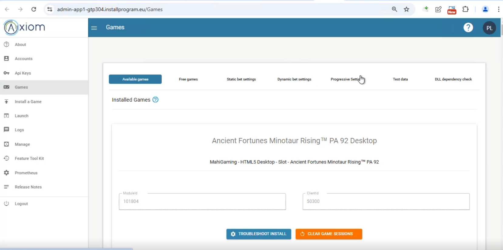

---

launch game page
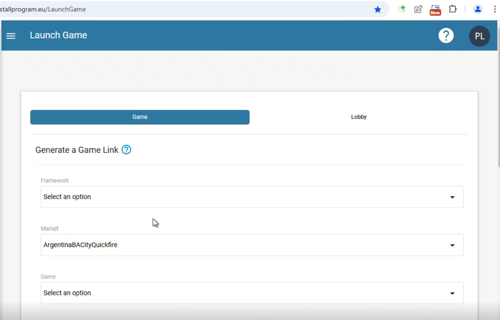

Game generate link

framework selection (titan, V, the harness)
framework version (letest preferred unless specified)

market
regulated markets / rules
DotCom market (unregulated): no regulation
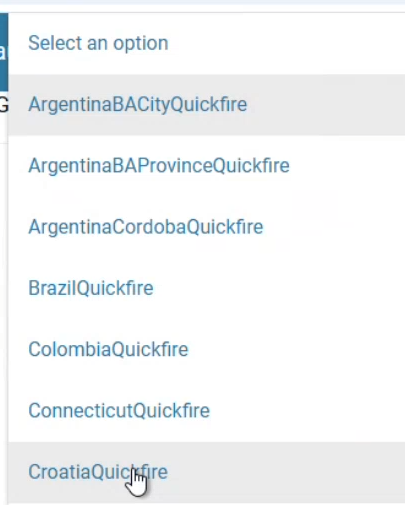
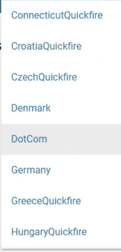

game
list of games installed on envionment (both desktop and mobile)
MID: module id : unique for each game (same for desktop and mobile)
CID: client id : for desktop: 503xx and mobile: 403xx
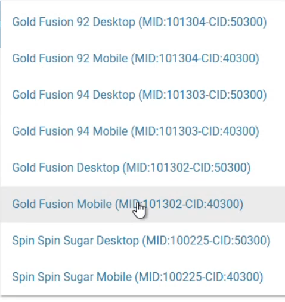

game clonning:
if game is cloned: MID remains the same but CID changes (403xx+1)
why to clone:
if the maths of the game is so good and high revenue geneating, then it is cloned and the new game is launched with diffrent look and feel

game version
game version is the version of the game
increases as the game is updated (bug fixes, new features, TCs)

host/formfactor
desktop or mobile or tablet

language code
language code is the language of the game
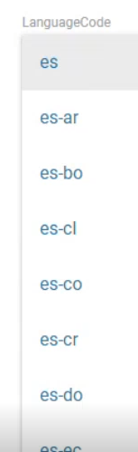

iframe
for specific resolution

username

password

---

manager

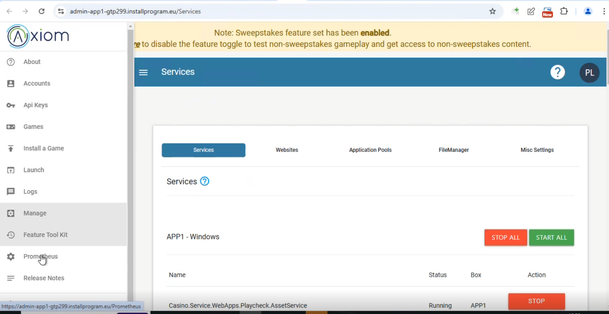

---

Prometheus
setting up test data
you can set your own combination

username
gamename

reelset

set your own combination manully

or with xml code

Test data:

1. How to edit the existing test data
   Axiom > manager > file manager > navigate to test data folder >

--
