eviornment, certification, deplyments, testing

---

url: gametechnology.io

games
roadmaps
documentation
tools
enviornments
certification
deployment

---

url: gametechnology.io/games
games

all games, variants, game type, studio

---

---

url: gametechnology.io/game/heroesmultiplierforture

Inside one game

details page

game portfolio
studio portfolio
studio details

variant
MID
Vyron
CID

---

project page
all games development details (all oprations done like market enty, game update, game addon)

---

setting

---

---

url: gametechnology.io/game/heroesmultiplierforture
(sweepstake project)

Inside one project

details
peoject id, name, etc

---

game dna page
maths of game
coine size
max min etc

overview
distribution: markets,
maths
feature
language
currencies

---

development
all development information

game info
in game video
game client files
tast data
math services

---

url: gametechnology.io/game/heroesmultiplierforture/test

testing

game requirements
game technology review
test plans
releases: when development is over its hand over to enhance for testing
defects
report vault

---

url: gametechnology.io/game/heroesmultiplierforture/25505
(release id)

inside release

summery
game dna: overview, maths, currency, bet details,, languages
artifacts: game specification document, helpfile, regukatory assets: links, URLs: dev, test, deploy
test data: test files
test plan
install
in game video
non fuctional testing
test request
support request
reports

---

ai chatbot

copilot
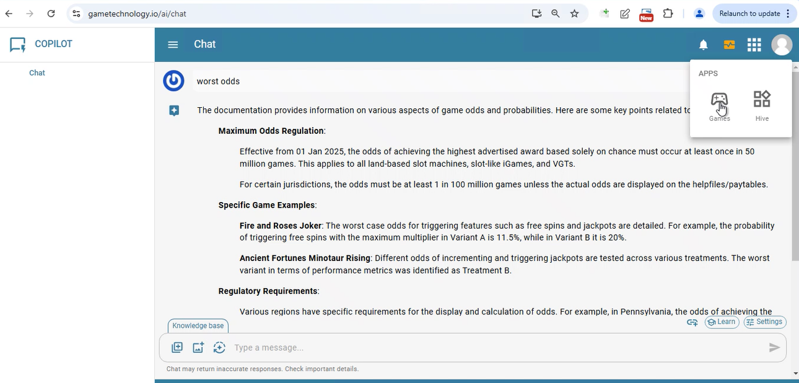

---

for asf games

hive

test data tool
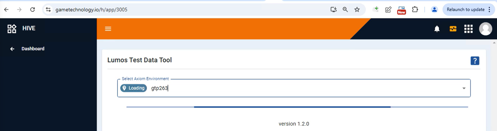

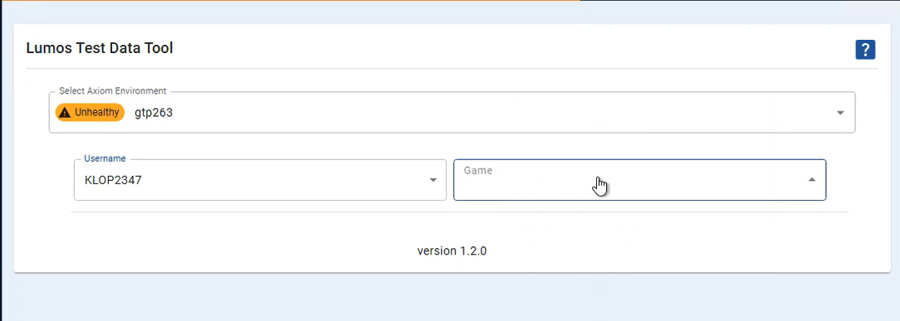

From hive also we can set test data like we do in axios > manage

---

for bandit games

pachment

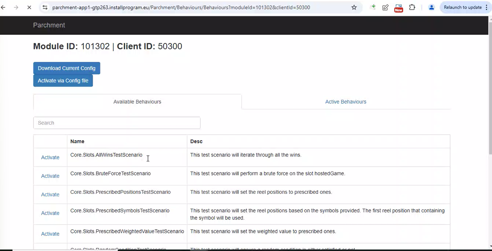

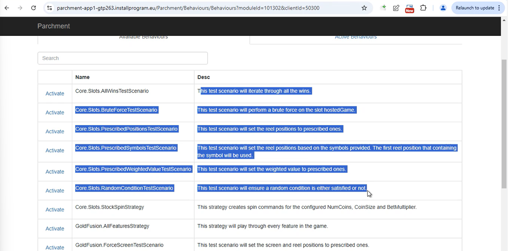

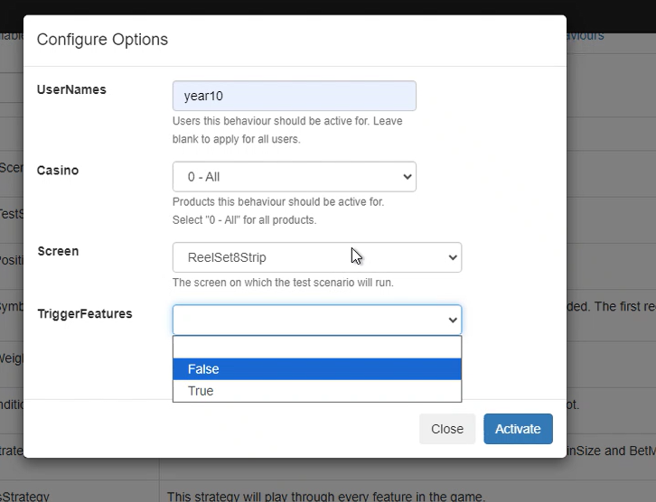

test data in json format

making sure MID and CID is same

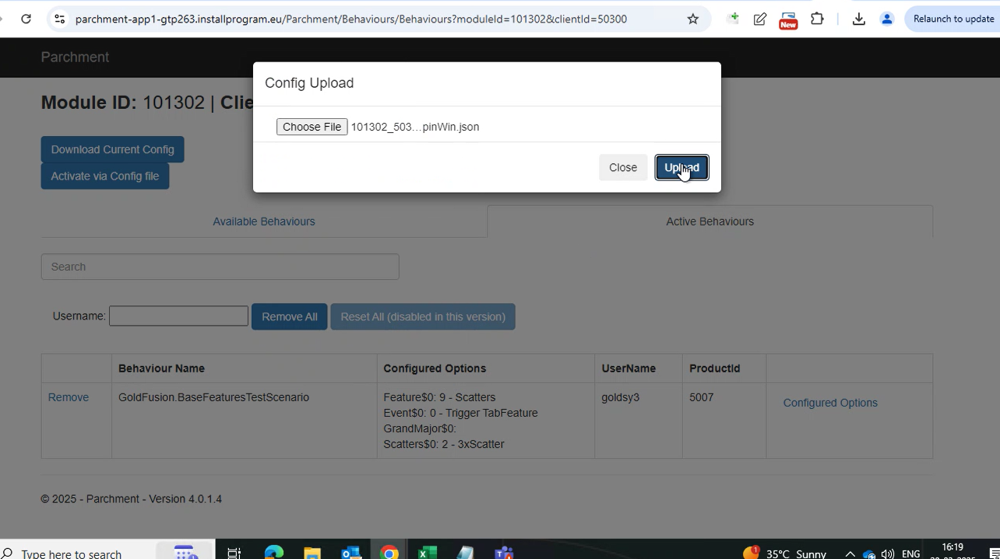

---

Framework TItan Harness

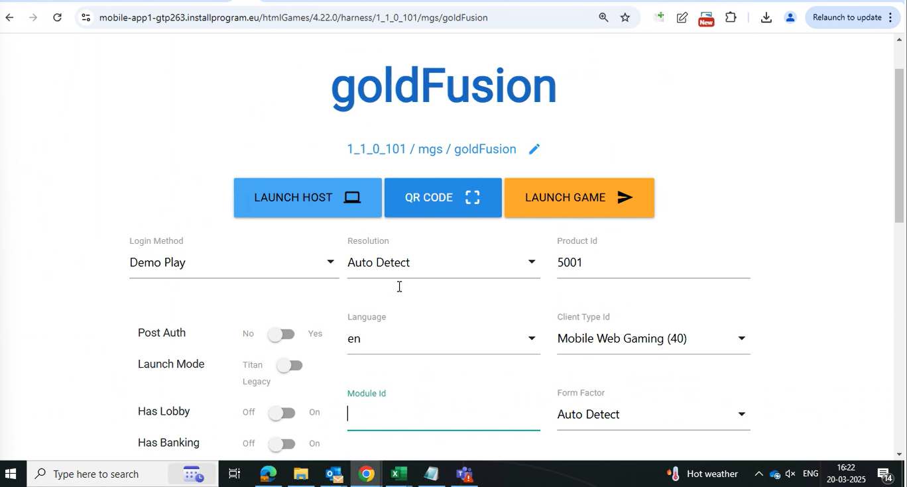
Generate the game link first from axiom and then lanch using titan harness
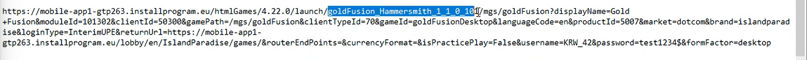
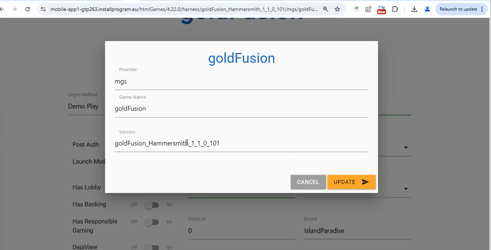
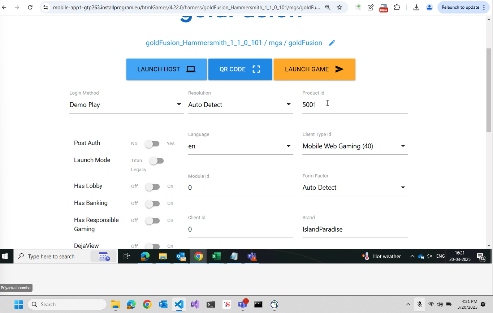

Axiom vs Titan harness

In titan harness you can add custom config while launching tha game

---

compliance testing

integrity
fairness

---

top awards 
win upto

---

