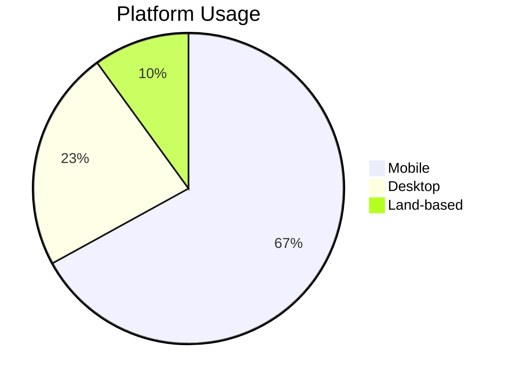

# 🎰 Casino & Slot Games Industry Guide

## 🌎 Global Market Leaders

| Category                | Location/Country |
| ----------------------- | ---------------- |
| Most Popular Slot Games | China            |
| Biggest Casino Market   | China            |
| Largest Casino Venue    | Macau            |
| Biggest US Casino Hub   | Las Vegas        |

## 📅 Historical Timeline

### First Casinos

- 🏛️ World's First Casino (1638)
- 🇺🇸 USA (1799)
- 🌍 Europe, UK, Australia, Canada, Asia, Africa (1800)

### Slot Machine Evolution

| Year | Milestone                              |
| ---- | -------------------------------------- |
| 1891 | First slot prototype (Sittman & Pitt)  |
| 1895 | Liberty Bell - First true slot machine |
| 1907 | Operator Bell with fruit symbols       |
| 1963 | Money Honey - First electromechanical  |
| 1976 | First video slot machine               |
| 1996 | First online slots                     |
| 2012 | Social casino gaming                   |
| 2020 | Crypto slots emergence                 |

## 💰 Market Statistics 2023

- Global Market Size: $130B
- 2028 Projection: $205B
- Online Revenue: $70B
- Mobile Share: 65%
- Average RTP: 92-97%

## 🎮 Top Casino Markets (Revenue 2023)

1. 🇲🇴 Macau: $37.5B
2. 🇺🇸 Las Vegas: $22.3B
3. 🇸🇬 Singapore: $5.9B
4. 🇲🇨 Monaco: $4.5B
5. 🇦🇺 Australia: $3.8B

## 🔧 Technical Specifications

### Payline Systems

- Classic: 1-50 lines
- All-ways: 243-1024 ways
- Megaways™: Up to 117,649 ways
- Cluster Pays

### Game Mathematics

| Type       | Details                      |
| ---------- | ---------------------------- |
| Volatility | Low/Medium/High              |
| Hit Rate   | 20-30%                       |
| House Edge | 2-15%                        |
| Min RTP    | UK: 94%, NJ: 83%, Macau: 80% |

## 👥 Player Demographics

### Age Distribution

- 21-34: 35%
- 35-50: 45%
- 51+: 20%

## 🚀 Future Trends

- AR/VR Integration
- Blockchain Gaming
- AI Personalization
- Metaverse Casinos
- Skill-based Hybrids

## 🏆 Notable Records

| Category           | Record               |
| ------------------ | -------------------- |
| Highest Online Win | €19.4M (Mega Moolah) |
| Most Popular Game  | Starburst (NetEnt)   |
| Best RTP           | Mega Joker (99%)     |
| Priciest Machine   | Zeus III ($500K)     |

## ⚖️ Responsible Gaming

- Self-exclusion
- Deposit Limits
- Time Tracking
- Reality Checks
- Loss Limits
- Cool-off Periods

## 🎯 Popular Features

### Base Game

- Standard/Expanding Wilds
- Sticky/Walking Wilds
- Multiplier Wilds

### Bonus Features

- Free Spins
- Pick & Click
- Cascading Reels
- Progressive Jackpots
- Gamble Options

## 🏢 Games Global Limited Profile

### Company Overview

| Detail          | Information           |
| --------------- | --------------------- |
| Founded         | 1994 (as Microgaming) |
| Headquarters    | Isle of Man           |
| Employees       | 3000+                 |
| Game Portfolio  | 3000+ titles          |
| Partner Casinos | 900+                  |
| Monthly Players | 260M+                 |

### Key Achievements

- First online casino software (1994)
- First mobile casino software (2004)
- Largest progressive jackpot network
- Record jackpot payout: €19.4M
- Pioneer in live dealer technology

### Notable Games

| Game Title       | Release Year | Special Features      |
| ---------------- | ------------ | --------------------- |
| Mega Moolah      | 2006         | Progressive Jackpot   |
| Thunderstruck II | 2010         | 243 Ways to Win       |
| Book of Oz       | 2018         | Re-spin Feature       |
| 9 Masks of Fire  | 2019         | Free Spins Multiplier |
| Immortal Romance | 2011         | Chamber of Spins      |

### Technologies & Innovations

- Progressive Jackpot Network
- Quickfire Platform
- Mobile-First Development
- VR Gaming Solutions
- Branded Content Partnerships

### Licensing & Compliance

- UKGC Licensed
- MGA Licensed
- ISO 27001 Certified
- eCOGRA Approved
- Multiple Market Certifications

### Market Presence

- Operating in 20+ regulated markets
- 40+ game studio partners
- 3000+ unique casino games
- 50+ progressive jackpot games
- Available in 25+ languages
