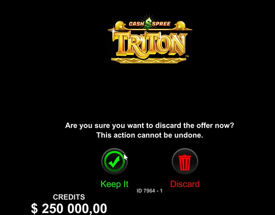
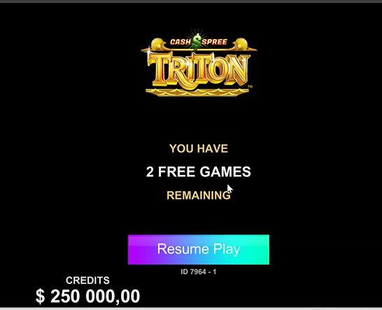
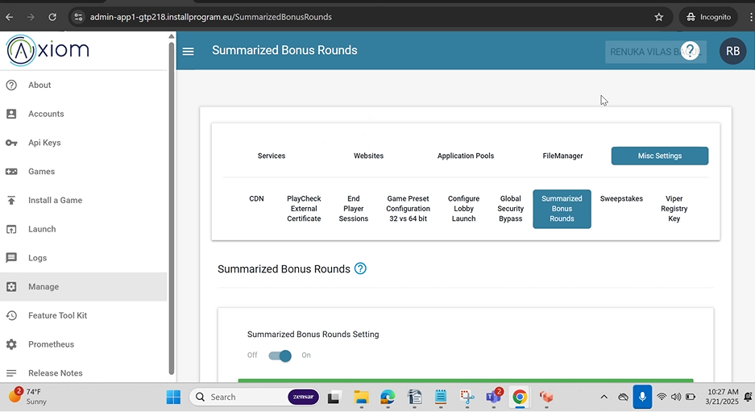
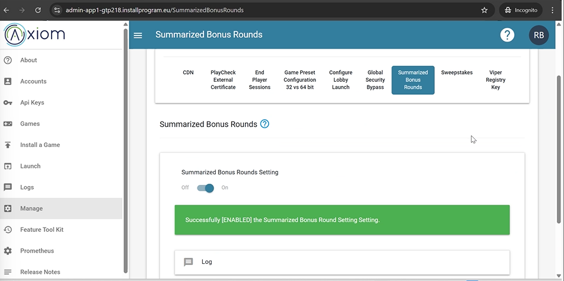
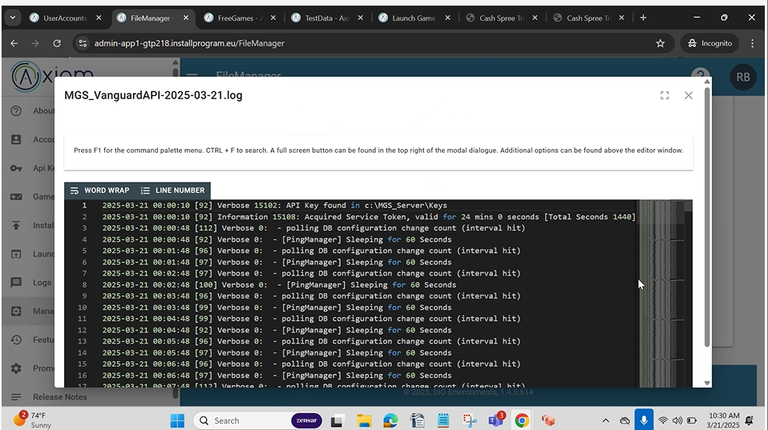
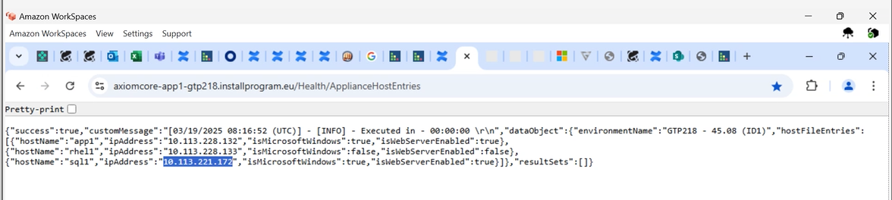
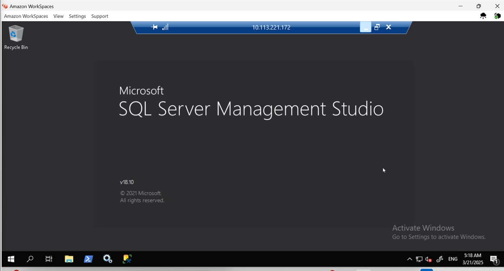
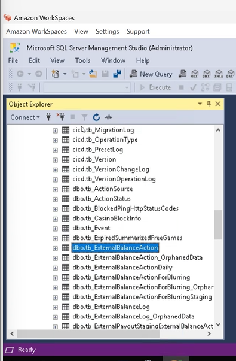

    # QuickFire

quickfire is operator 
no need to create user

---
Axiom > market: qickfire > launch game
Default balance : 250,000

--- 

url: 

&externalToken = token1
! Always

update username because when you launch in quicfire name will be token1 only so if someone created late then both will conflict

Change in url and it will set

---
Axiom > accounts > 

Name always start with aa_`<username>`

---
Fre game setting 

Creating free game offer 

---
free game entry sceen

Discard sceen (accept / reject)

---
Free game resume sceen
// if you played one free game out of 3 and refreshed the game

---

Free game summery sceen 
After completing all free game spins it will show all the samarry.

---
Summerized Bonus Toggle
Need to turn on

---

Test data

Assign test data

---

Viewing log files

---
#### Important

In free spin if there are 3 spins
initital balance: 500

spin 1
init bal: 500
win: 10

spin 2
init bal: 500
loss: 100

spin 3
init bal: 500
win: 50

final bal: 440

In log it will update section completed

---
RDP Connection

 

Databses> vanguard state> tables> 
dbo.db.ExternalBalanceAction

