# Static Testing for Casino Games

## Overview
Static testing is a crucial quality assurance process for casino games that involves reviewing documentation, configurations, and game parameters without executing the game.

### Purpose
- Verify game specifications match implementation
- Ensure regulatory compliance
- Validate mathematical models
- Check RTP (Return to Player) configurations
- Review paytable accuracy

---
## Website GameInformation

game search

MID
CID

---

### Inside Game Details

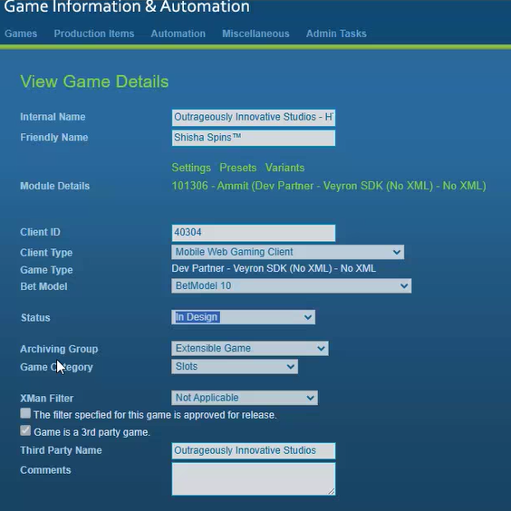

### RTP Variants
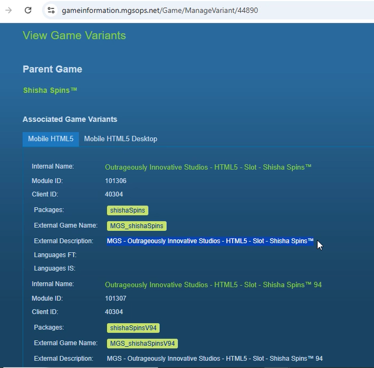
- Standard variants required: 
  - 96%
  - 94%
  - 92%
- Special market variant: 
  - Germany: 86%
- Different variants for different markets and RTPs

### Class Verification with gametechnology.io page
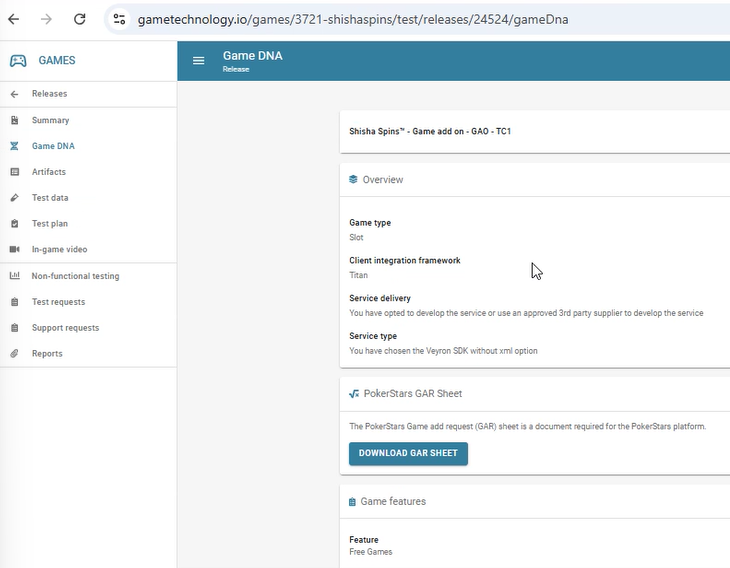
- Verify with gametechnology.io page
- Check preset configurations

---
---

## Game Specification Document

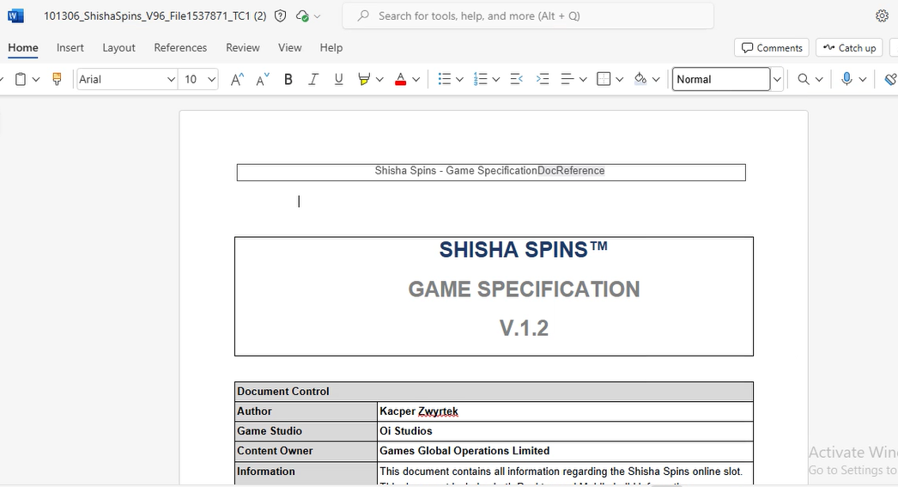

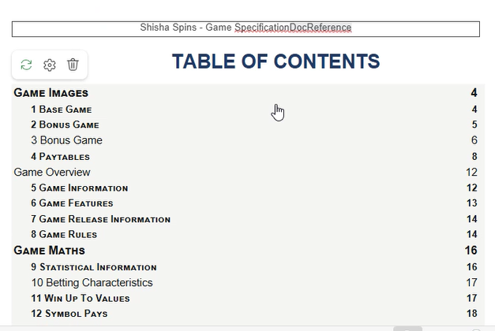

> **Important**: Everything must match with SpecDoc

---
## TestRail Documentation
### Static Testing Information

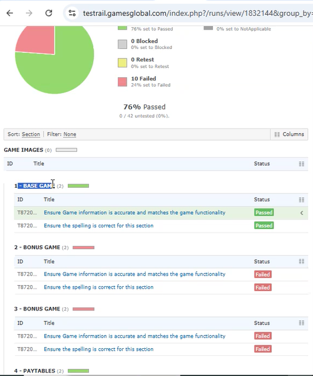

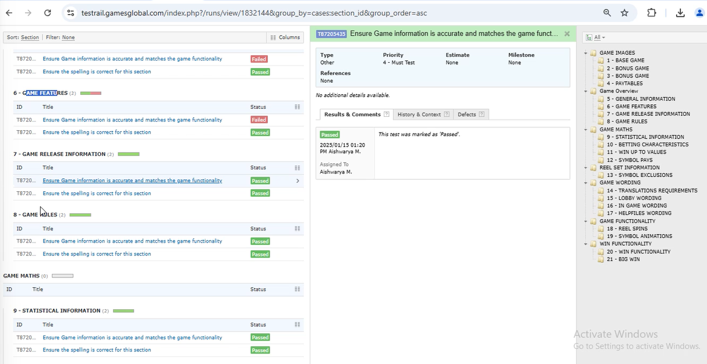

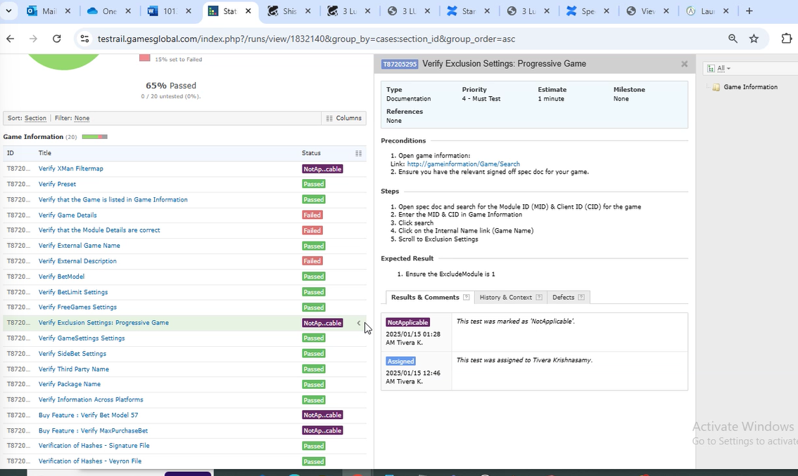

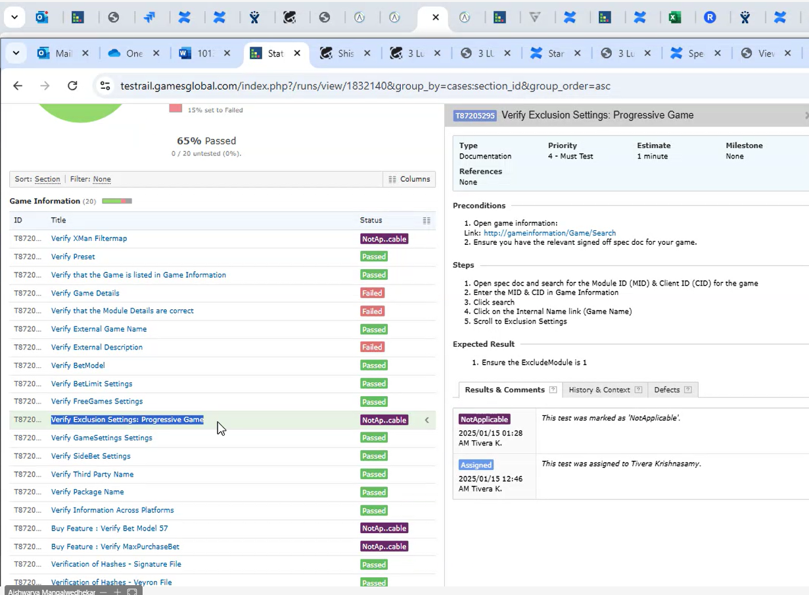

---
## ParSheet Analysis
Detailed mathematical information including payouts and certification requirements

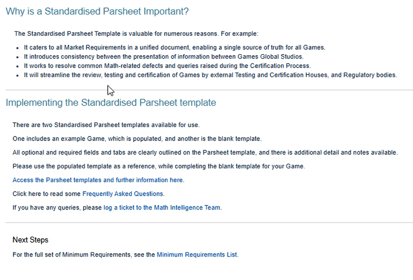
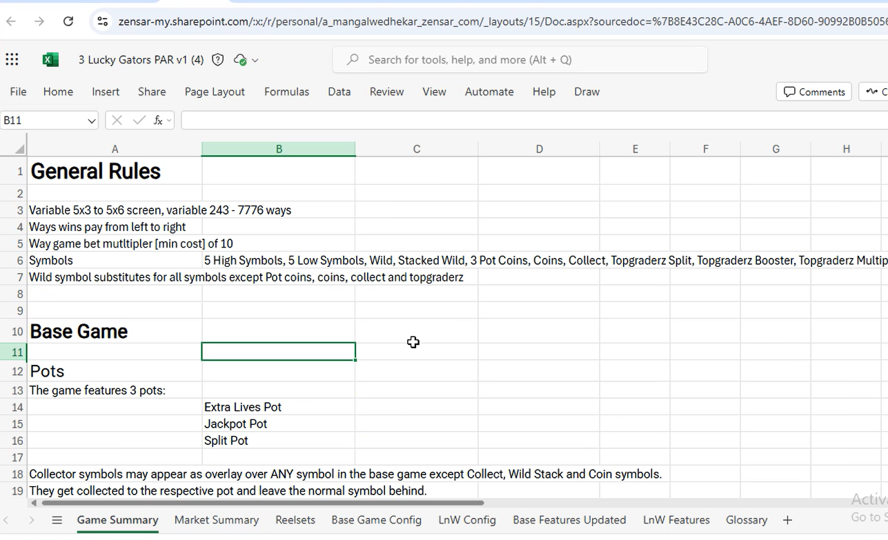
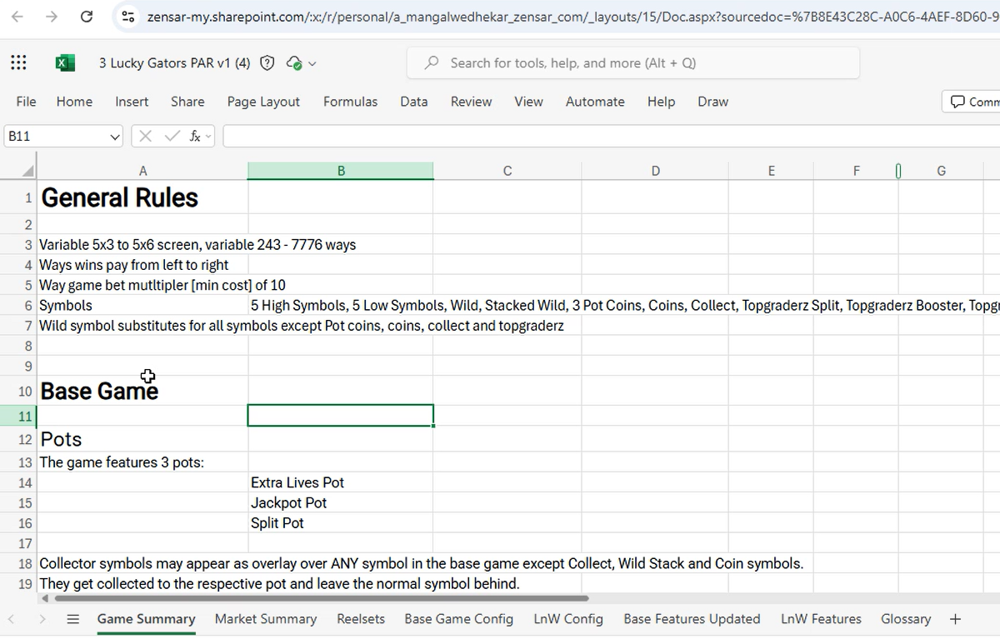

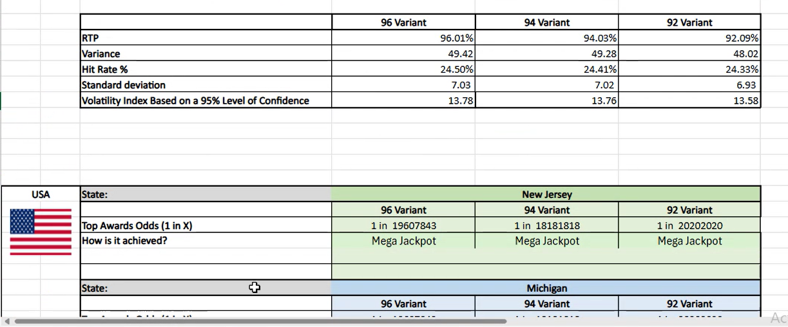
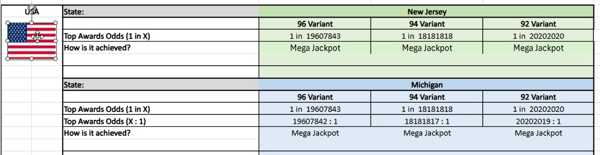
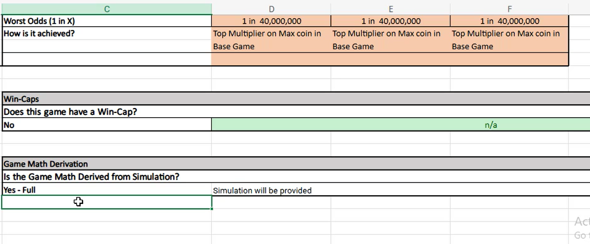

## Verification Checklist
- [ ] All specifications match SpecDoc
- [ ] Game Technology Platform (GTP) verification complete
- [ ] ParSheet calculations verified
- [ ] RTP variants confirmed
- [ ] Market-specific requirements checked
- [ ] TestRail documentation complete

> **Final Verification**: Everything should match across SpecDoc, GTP, and ParSheet

